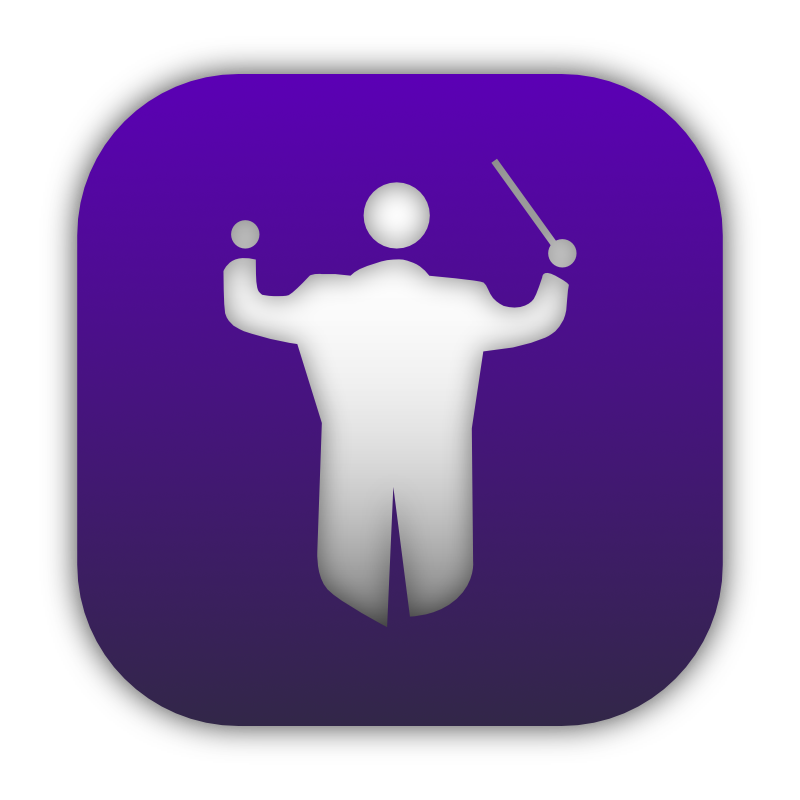
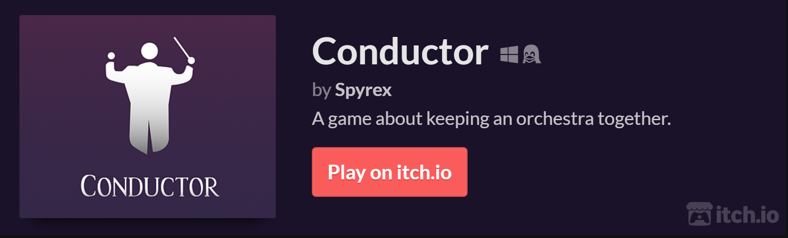
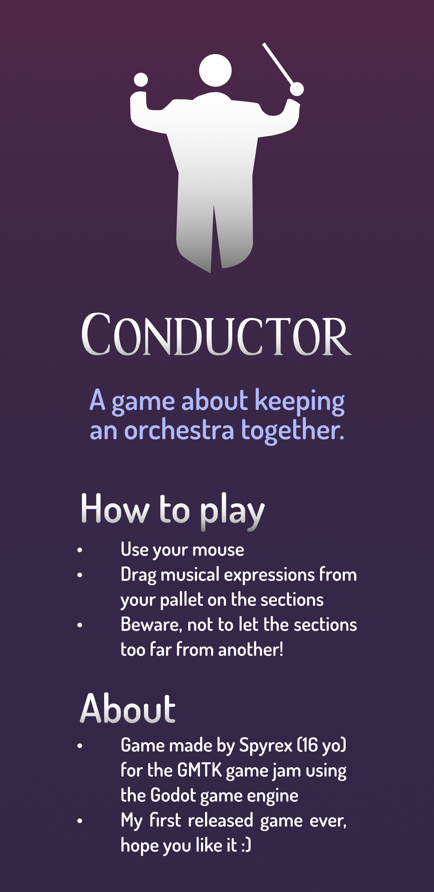

	</img>

<h1 align="center" style="margin-bottom: 0px;"><samp>Conductor</samp></h1>

<h3 align=center><samp>&gt; About</samp></h4> 

	<samp>Conductor is a game made for the GMTK Jam 2021
	using the Godot game engine.</samp> 
	<a href="https://www.youtube.com/watch?v=78vAlFQlHYY">Watch gameplay on Youtube</a>
	

		<a href="https://spyrex.itch.io/conductor">
			</img>
		</a>
	

 <samp>&#9776; How to play</samp>

	 
	

		</img>
	

<table align="center">
	<th>
		<h6 align="center">
			<samp>
				Credits
			</samp>
		</h6>	
	</th>
	<tr>
	  <td><samp>Hall of the Mountain King by Kevin MacLeod http://incompetech.com</samp></td>
	</tr>
	<tr>
		<td><samp>
			Creative Commons — Attribution 4.0 International — CC BY 4.0 
			Free Download / Stream: https://bit.ly/hall-of-the-mountain-king 
			Music promoted by Audio Library</samp>
		</td>
	</tr>
	<tr>
		<td><samp>
			Conductor entry icon: 
			Baton by Luis Prado from the Noun Project</samp>
		</td>
	</tr>
	<tr>
		<td><samp>
			Conductor person icon: 
			Orchestra Conductor by GiulioPN from the Noun Project</samp>
		</td>
	</tr>
</table>
